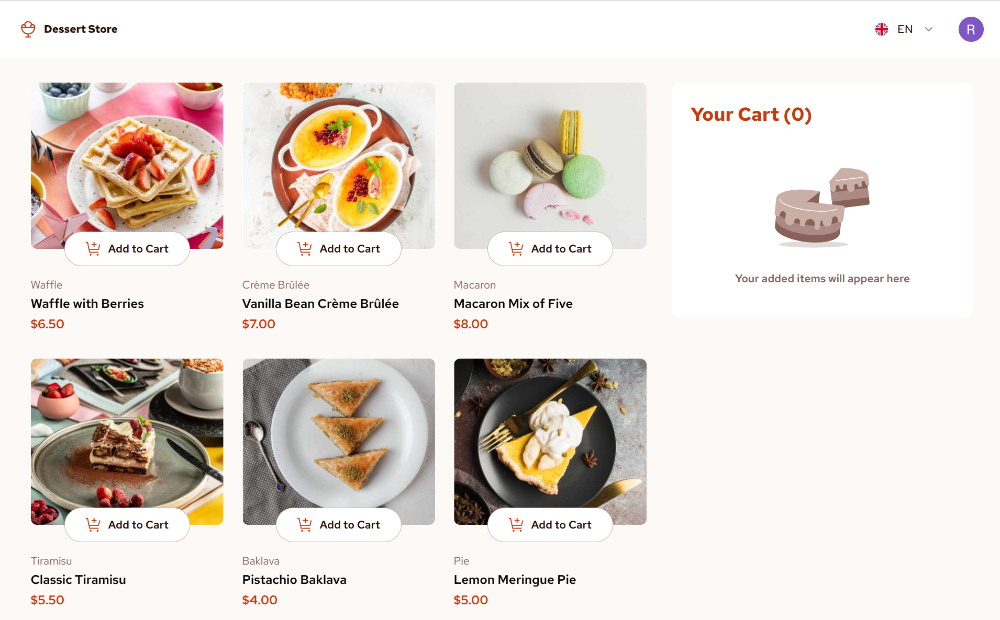

# Frontend Mentor - Dessert store

This is a solution to the [Product list with cart challenge on Frontend Mentor](https://www.frontendmentor.io/challenges/product-list-with-cart-5MmqLVAp_d).

## Table of contents

- [Frontend Mentor - Dessert store](#frontend-mentor---dessert-store)
  - [Table of contents](#table-of-contents)
  - [Overview](#overview)
    - [The challenge](#the-challenge)
  - [Screenshot](#screenshot)
    - [Links](#links)
  - [My process](#my-process)
    - [Built with](#built-with)
  - [Author](#author)

## Overview

### The challenge

Users should be able to:

- Add items to the cart and remove them
- Increase/decrease the number of items in the cart
- See an order confirmation modal when they click "Confirm Order"
- Reset their selections when they click "Start New Order"
- View the optimal layout for the interface depending on their device's screen size
- See hover and focus states for all interactive elements on the page

## Screenshot

### Links

## My process

### Built with

- Svelte & SvelteKit
- Drizzle ORM & Neon Serverless Database
- Better-Auth for authentication
- Stripe for payment processing
  
## Author

- Frontend Mentor - [@onesramis](https://www.frontendmentor.io/profile/onesramis)
  